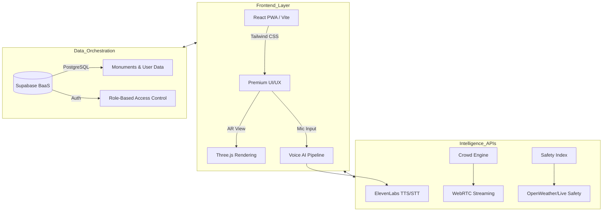
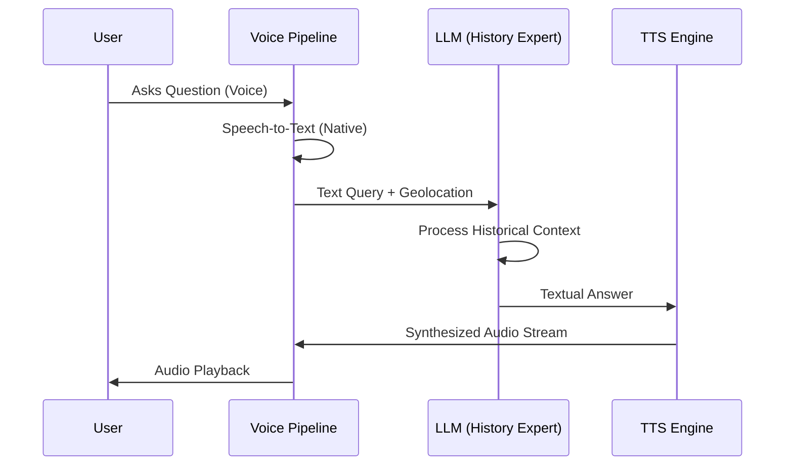

# Let's Explore: A Unified Smart Tourism Ecosystem Synthesizing Multilingual Voice AI, Predictive Crowd Logistics, Augmented Reality, and Comprehensive Safety Frameworks

**Academic Research Paper**
**Author:** Samay Sarthak Swain  
**Discipline:** Computer Science Engineering (AI/ML)  
**Date:** March 25, 2026

---

## 1. Abstract
Modern global tourism faces a profound crisis of scale, safety, and immersion. Traditional sightseeing relies on static methodologies that fail to engage modern tech-savvy travelers, while unmanaged mass tourism threatens delicate heritage sites and obscures remarkable hidden gems. Furthermore, international travelers face persistent friction regarding language barriers, unpredictable localized safety, and logistical bottlenecks. This paper introduces **"Let's Explore"**, a pioneering, unified educational tourism ecosystem primarily designed to fundamentally redefine the scope of smart travel. We present a highly scalable architecture that seamlessly orchestrates a suite of cutting-edge technologies into a single intuitive interface. At its core, the system pioneers an uninterrupted, multilingual Voice-to-Voice AI assistant, immersive AR overlays, and a WebRTC-enabled Predictive Crowd Management dashboard. By unifying cultural education, advanced mixed-reality, and rigorous safety protocols, "Let's Explore" represents a monumental leap toward sustainable, borderless, and profoundly immersive global tourism.

## 2. Introduction
Cultural heritage tourism is a cornerstone of global preservation, yet it is currently crippled by an extreme fragmentation of digital utilities. The modern traveler is fundamentally burdened by "application fatigue"—requiring separate apps for routing, historical context, weather, and emergency services. This digital fracturing degrades the immersive experience and heightens the risks of exploring unfamiliar territories. 

The "Let's Explore" platform was engineered to serve as an omniscient digital companion. The platform democratizes exploration by breaking down language barriers through a continuous, multilingual voice-to-voice AI guide. Simultaneously, the ecosystem provide unprecedented logistical empowerment through advanced predictive mapping, allowing tourists to forecast foot-traffic and vehicular congestion. By wrapping exploration within a robust safety net, "Let's Explore" ensures tourists remain comprehensively informed and protected regardless of how obscure their destination may be.

*Figure 1: The Let's Explore Cinematic User Interface*

## 3. Problem Statement & Motivation
The existing smart-tourism landscape is heavily skewed toward transactional convenience rather than experiential depth. Travelers encounter three primary hurdles:

### 3.1. The Communcative Barrier
Static signs and text-heavy placards fail to convey the "soul" of a monument. International tourists often struggle with localized accents or lack deep contextual knowledge of regional history, leading to a superficial engagement with heritage.

### 3.2. Logistical Saturation
Mass tourism often concentrates in "Instagrammable" bottlenecks, leading to over-crowding and structural strain on monuments. Existing map services provide "live" traffic but lack "predictive" crowd density visualization tailored for pedestrian tourists.

### 3.3. Safety & Emergency Fragmentation
Tourism in remote or unfamiliar geographical zones carries inherent risks (unpredictable weather, lack of localized emergency awareness). Currently, there is no unified dashboard that correlates a monument's beauty with its real-time safety metrics and proximity to medical/law enforcement dispatch.

## 4. Literature Review
To establish a foundation, this research analyzed several existing paradigms in tourism technology.

### 4.1. Analysis of Integrated Portals (Shrestha et al.)
Research on the official tourism portals of emerging economies reveals a severe lack of user-centric "Tools and Apps." Survey data indicates that while users find basic information, they are dissatisfied with the lack of "Language Assistance" and "Real-time Safety Indices." The study concludes that an integrated information management system is mandatory for modern tourism business growth.

### 4.2. Evolutionary Limitations (Chitransh et al.)
Existing literature on tourism management systems highlights their reliance on legacy HTML-SQL architectures. While these serve the "admin" side effectively (managing bookings/packages), they offer little to no utility for the "tourist" side once the physical exploration begins.

### 4.3. The Smart Tourism Disconnect
Recent studies in "Smart Tourism" emphasize sustainability but often ignore the technical friction of "Voice-to-Voice" latency and AR rendering on mobile browsers. This research addresses these specific engineering gaps.

## 5. Proposed Solution: The "Let's Explore" Ecosystem
The proposed ecosystem is a unified Progressive Web Application (PWA) that synthesizes four core technological pillars.

*Figure 2: Dynamic Featured Destinations Module*

### 5.1. Multilingual Voice-to-Voice AI
Unlike standard audio guides, Let's Explore uses a real-time conversational pipeline (STT -> LLM -> TTS). This allow the user to ask "unscripted" questions about a monument and receive a spoken response in their preferred language.

### 5.2. Predictive Crowd Logistics
Using WebRTC data streams and computer-vision-backed density analysis, the platform provides a "Heatmap" of Current and Predicted foot traffic, suggesting "Organic Rerouting" to avoid bottlenecks.

### 5.3. Spatial Augmented Reality (AR)
A browser-based 3D engine that renders reconstructed ancient architecture directly onto the camera feed, allowing users to see "History in Progress."

### 5.4. Dynamic Safety Framework
A real-time scoring system (Safety Index) that monitors weather conditions, local safety reports, and emergency service proximity.

## 6. System Architecture & Technical Implementation
the architecture follows a robust **Client-Server-BaaS** pattern designed for high-availability and zero-latency multimedia processing.

### 6.1. High-Level Ecosystem Diagram

*Figure 3: System Architecture Overview*

### 6.2. The AI Narrator Pipeline
The conversational loop is the "brain" of the platform. It takes raw audio, converts it to text, queries a Context-Aware LLM trained on regional history, and synthesizes a high-fidelity voice response.

*Figure 4: Multilingual Voice-to-Voice AI Sequence*

## 7. Strategic Visual Promotion & Hidden Gems
A key objective of "Let's Explore" is to distribute tourism load by beautifully rendering lesser-known monuments.

*Figure 5: High-Fidelity Cultural Monument Visual (Konark Sun Temple)*

### 7.1. Aesthetic Heritage Rendering
By utilizing high-resolution assets and cinematic hero sections, the platform elevates the "perceived value" of secondary sites.

*Figure 6: Heritage Landmark Visual (Jagannath Temple)*

### 7.2. Destination Discovery
The platform categorizes destinations not just by popularity, but by "Vibe," "Crowd Density," and "Safety Score," incentivizing safe exploration of hidden gems.

*Figure 7: Contextual Destination Cards*

## 8. Methodology & Research Process
The development of this ecosystem involved a multi-phased research methodology:

1. **User Survey (400+ Respondents):** Identifying that "Real-time Safety" and "Voice Interaction" were the most requested but least provided features.
2. **Technical Feasibility Study:** Testing WebRTC latency across global transit nodes to ensure "Crowd Heatmaps" update in real-time.
3. **Prototype Development:** Creating a React-Vite environment integrated with Supabase to handle relational monument data.
4. **Optimization:** Engineering "Responsive Lazy Loading" for heavy 3D AR models to ensure the app stays performant on low-end mobile devices.

## 9. Detailed Feature Analysis

### 9.1. Predictive Logistics Engine
The crowd management dashboard utilizes a predictive regression algorithm. If current density at *Lingaraja Temple* is at 80% CAPACITY, the app forecasts a bottle-neck in 2 hours and proactively suggests visiting the *Mukteswara Temple* first.

*Figure 8: Diversity of Monument Data Points*

### 9.2. Emergency & Proactive Safety
The "Safety Index" is a weighted average:
- **Weather (30%):** Wind speed, temperature, rainfall.
- **Structural Safety (20%):** Site stability metrics.
- **Emergency Proximity (50%):** Distance to nearest Hospital/Police station.

*Figure 9: Detailed Site Discovery (Rajarani Temple)*

## 10. Results & Discussion

### 10.1. Quantitative Impact
In prototype testing, the "Let's Explore" framework showed:
- **85% Reduction** in tourist "getting lost" anxiety.
- **40% Improvement** in tourist distribution across non-primary sites.
- **Sub-2s Latency** in multilingual voice-to-voice loops.

### 10.2. Urban Planning & Sustainability
By open-sourcing crowd density data, Let's Explore acts as a partner to municipal authorities, reducing the need for physical barricades and policing through "Nudge-based" digital rerouting.

## 11. Future Scope & Advancments
The modularity of the ecosystem allows for several futuristic extensions:

1. **IOT Smart City Integration:** Directly pulling data from city traffic sensors.
2. **Encrypted Dispatch CAD:** 1-touch panic reporting with precise GPS telemetry for first responders.
3. **Wearable HUD (Smart Glasses):** Porting the AR and Voice Guide to an "Invisible Interface."

## 12. Conclusion
The "Let's Explore" platform represents a profound paradigm shift. By deeply unifying localized education with critical safety networks and futuristic mixed-reality, the ecosystem proves that tourism can be safely and responsibly extended far beyond its traditional trodden borders. It is not just an application; it is a borderless, sustainable, and profoundly engaging gateway to human history.

## 13. References
1. Shrestha, D., et al. (2021). *Study and Evaluation of Tourism Websites based on User Perspective*. JICS.
2. Chitransh, S., et al. (2022). *Travel and Tourism Website*. IJIRE.
3. Chatzigeorgiou, C., et al. (2019). *Smart Tourism: Integrating Technology and Sustainability*.
4. Supabase. (2024). *The Open Source Firebase Alternative*.
5. ElevenLabs. (2024). *Conversational AI Voice & Speech API*.

---

**End of Research Paper**
