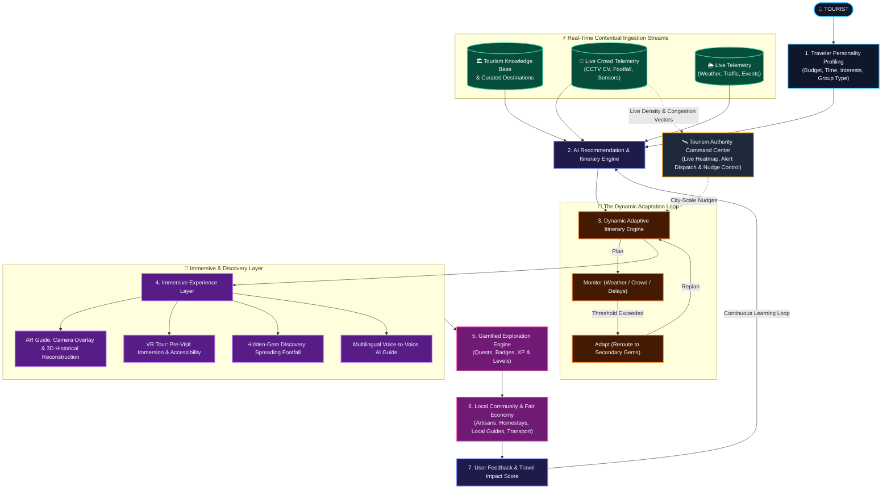
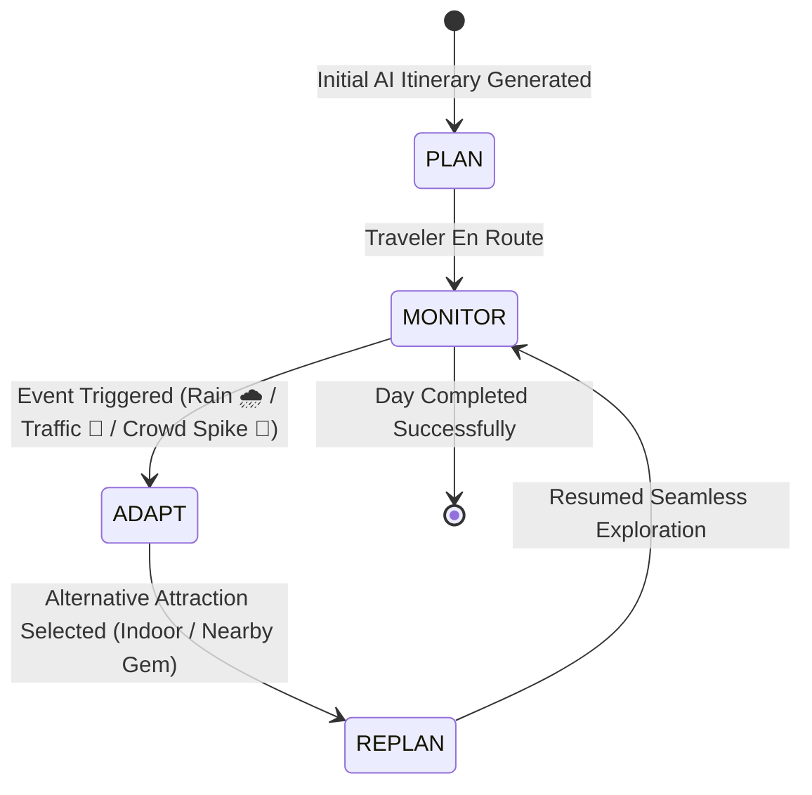

# 🚀 LET'S EXPLORE — Smart India Hackathon (SIH) Master Blueprint
## AI-Powered • AR/VR • Crowd-Aware • Gamified • Community-Driven Smart Tourism

> ### 🏆 Strongest SIH Positioning Statement
> **“Let’s Explore transforms tourism from simply finding places into an intelligent, immersive, adaptive, and gamified travel experience. We do not just manage tourists — we intelligently distribute tourism, preserve heritage, and empower local communities.”**

---

## 🧭 The 6 Core Pillars at a Glance

```
  ┌───────────────────┐    ┌───────────────────┐    ┌───────────────────┐
  │      🧠 AI        │    │    👥 CROWD AI    │    │    🥽 AR / VR     │
  │ Personalized      │    │ Smart Crowd       │    │ Immersive Spatial │
  │ Intelligence      │    │ Distribution      │    │ Tourism           │
  └───────────────────┘    └───────────────────┘    └───────────────────┘
  ┌───────────────────┐    ┌───────────────────┐    ┌───────────────────┐
  │  🎮 GAMIFICATION  │    │  💎 HIDDEN GEMS   │    │  🏪 LOCAL ECONOMY │
  │ Explore, Earn,    │    │ Discover the      │    │ Direct Community  │
  │ Level Up & Compete│    │ Unexplored        │    │ & Artisan Uplift  │
  └───────────────────┘    └───────────────────┘    └───────────────────┘
```

---

## 🔄 1. Complete Ecosystem Process Flow Diagram



---

## 🧠 2. Deep-Dive: The 12 System Innovations

### 1. AI Personalized Travel Engine
Traditional portals ask "Where do you want to go?" and list hotels. Let's Explore infers **who the traveler is** and customizes the entire journey.
* **Input Vectors:** User interests, budget ceiling, time window, group typology (solo, family, couple, friends), mobility level, and real-time location.
* **Traveler Archetypes Synthesized:**
  * 🎒 **Adventure Explorer** $\rightarrow$ Rugged trails, coastal treks, wildlife sanctuaries.
  * 🏛️ **Heritage Explorer** $\rightarrow$ Epigraphy, architectural nuances, historical archives.
  * 🍛 **Food Explorer** $\rightarrow$ Hyper-local street food hubs, traditional kitchens, authentic Odia thalis.
  * 📸 **Photography Explorer** $\rightarrow$ Golden hour viewpoints, architectural symmetry spots, sunrise vistas.
  * 🙏 **Spiritual Explorer** $\rightarrow$ Sacred temple circuits, morning pujas, meditation ghats.
  * 👨‍👩‍👧 **Family Traveler** $\rightarrow$ Kid-friendly facilities, shaded pathways, safe dining, easy transit.
  * 💰 **Budget Traveler** $\rightarrow$ Low-cost transit, homestays, public heritage sites.
  * 💎 **Hidden-Gem Hunter** $\rightarrow$ Off-the-beaten-path artist villages, secluded lakes, undisturbed ruins.

---

### 2. Real-Time Crowd Intelligence & Load-Balancing
Instead of passive informational maps, the platform provides active crowd guidance:
* **Real-Time Status Indicators:**
  * 🟢 **Low Crowd:** *Optimal time — Visit now!*
  * 🟡 **Moderate Crowd:** *Normal footfall — Expected wait: 15 mins.*
  * 🔴 **High Congestion:** *Heavy bottleneck — Expected wait: 45–60 mins.*
* **Intelligent Alternative Routing:**
  > *"Lingaraj Temple is currently saturated (🔴 85% capacity, 50m wait). We recommend visiting Mukteswara Temple (🟢 12% capacity, serene atmosphere) right now and returning to Lingaraj at 4:30 PM."*
* **Telemetry Data Sources:** Edge CCTV computer-vision centroid detection, ticketing throughput, anonymous GPS telemetry, and historical hourly regression patterns.

---

### 3. Dynamic Itinerary Engine: `PLAN → MONITOR → ADAPT → REPLAN`
Most travel apps generate an itinerary once and never change it when reality changes. Let's Explore's core loop continuously adapts:



* **Live Scenario:** Morning plan is `Outdoor Temple → Open-Air Museum → Beach Sunset`.
* **Disruption:** Sudden afternoon monsoon downpour detected via live weather telemetry.
* **Autonomous Adaptation:** System instantly shifts schedule to `Ancient Sculpture Indoor Gallery → Authentic Artisan Handloom Workshop → Covered Evening Cultural Showcase`.

---

### 4. In-Browser AR Tourism: The Living Camera Guide
* **Turn Phone into a Smart Lens:** No app store download needed (instant WebXR / Three.js).
* **Historical Reconstruction:** Pointing the camera at weathered or ruined stones visually resurrects the full structure as it stood 300 to 800 years ago.
* **Contextual HUD:** Overlays stone inscription translations, architectural fun facts, spoken audio guides in the user's native tongue, and hidden quest tokens right onto the camera feed.

---

### 5. Virtual Reality (VR) — Pre-Visit Immersion & Universal Accessibility
* **Virtual Exploration Before Travel:** 360° interactive virtual tours allow travelers to preview monuments, temple courtyards, and museum exhibits.
* **Universal Accessibility:** Elderly travelers or individuals with physical disabilities who cannot climb steep temple steps or navigate rough terrain can experience India's heritage in full fidelity from home.

---

### 6. Gamified Tourism — The High-Engagement Engine
Tourism becomes an interactive quest where learning and exploring earn tangible recognition:

#### 🏆 Explore XP Matrix
| Traveler Action | XP Reward | Badge / Perk Unlocked |
| :--- | :--- | :--- |
| **Visit Primary Heritage Landmark** | `+100 XP` | Heritage Seeker |
| **Discover Verified Hidden Gem** | `+150 XP` | Off-the-Beaten-Path Explorer |
| **Savor Authentic GI-Tagged Food Item** | `+50 XP` | Taste of Odisha Culinary Badge |
| **Complete Camera AR Archaeological Scan** | `+100 XP` | Digital Archaeologist |
| **Support Certified Rural Artisan Workshop** | `+100 XP` | Patron of Living Culture |
| **Attend Verified Folk Cultural Festival** | `+200 XP` | Festival Connoisseur |

#### 🥇 Progression Tiers
$$\text{Level 1: Novice Explorer} \rightarrow \text{Level 2: Adventurer} \rightarrow \text{Level 3: Cultural Discoverer} \rightarrow \text{Level 4: Heritage Champion} \rightarrow \text{Level 5: Master Odisha Ambassador}$$

#### 🎯 Real-World Location Quests
* 🏛️ **Heritage Hunt:** *"Discover 3 historical water tanks (Pushkarinis) in Old Town Bhubaneswar."* $\rightarrow$ Unlocks **Water Architect Badge 🏅**.
* 🍛 **Culinary Trail:** *"Try authentic Chhena Poda at Pahala and Dalma at a local village kitchen."* $\rightarrow$ Unlocks **Epicurean Explorer 🏅**.

---

### 7. Hidden-Gem Discovery: De-Congesting Tourism
* **The Problem:** 80% of tourists crowd 5% of famous monuments, leading to erosion, long queues, and frustrating experiences, while stunning secondary heritage sites remain neglected.
* **The Let's Explore Paradigm:**
  $$\text{Famous Bottleneck Destination (🔴 Overcrowded)} \xrightarrow{\text{AI Smart Nudge}} \text{Hidden Cultural Jewel (🟢 High Quality, Serene, Authentic)}$$
* **SIH Winning Pitch:** *"We don't just manage tourists; we distribute tourism wealth and footfall evenly across regions."*

---

### 8. Local Community & Direct Artisan Economy
Cuts out extractive 50–70% commercial broker markups and directly connects travelers with the grassroots ecosystem:
* **Direct Geo-Routing:** Direct navigation to UNESCO-recognized hereditary artisan villages like **Raghurajpur** (5,000-year living Pattachitra tradition) and **Pipili** (Chandua applique art).
* **Transparent Pricing Intelligence:** Fair-trade price benchmarks protect both tourists from tourist-trap scams and artisans from price undercutting.
* **Grassroots Beneficiaries:** Local guides, traditional homestays, auto/cab drivers, community restaurants, and craft families.

---

### 9. Multilingual Voice-to-Voice AI Tour Guide
* **Natural Spoken Interaction:** Travelers talk naturally in their native language:
  * **English:** *"Tell me what this stone carving depicts."*
  * **Odia:** *"ମୋ ପାଖରେ ଥିବା ପ୍ରାଚୀନ ମନ୍ଦିର ବିଷୟରେ କୁହନ୍ତୁ।"*
  * **Hindi:** *"इस मंदिर की वास्तुकला की क्या विशेषता है?"*
* **Low-Latency Loop:** Client Speech-to-Text $\rightarrow$ Knowledge Base RAG $\rightarrow$ Expressive Neural Voice Synthesis delivered in **under 1.8 seconds**.
* **Zero Hallucination:** Answers are anchored in verified Archaeological Survey of India (ASI) and regional archival knowledge bases.

---

### 10. Smart Reward & Local Business Coalition
* XP and badges earned through exploration translate into real economic value:
  * 🎟️ Discount vouchers at certified local cultural cafes and GI-craft shops.
  * 🏨 Concessions on eco-homestays and sustainable state transport.
  * 🎫 Express entry passes to state cultural dance and light festivals.
* Local verified businesses gain a free, zero-commission marketing channel by participating as challenge checkpoints.

---

### 11. Sustainable Tourism & Travel Impact Score
* **Quantified Eco-Responsibility:** Travelers earn a live **Travel Impact Score** based on green exploration choices:
  * 🚶 Walking or cycling between clustered heritage monuments.
  * 🚌 Utilizing public metro/bus transport rather than private vehicles.
  * 🏡 Choosing certified eco-homestays over commercial chains.
  * 🚫 Zero-plastic and heritage preservation pledges.
* Rewards tourists not for how much money they spend, but for **how conscientiously and sustainably they explore**.

---

### 12. Tourism Authority Command Center (G2G / B2G Dashboard)
A dedicated administrative dashboard for State Tourism Departments, Police, and Municipal Smart City Centers:
* **Live Heatmap Matrix:** Real-time visual density of tourists across all city landmarks.
* **Congestion Alerts & Automated Nudges:** One-click automated traffic redirection to prevent stampedes before religious processions or festivals.
* **Emergency Telemetry:** Fast dispatch coordination with live tourist safety metrics, hospital proximity, and local weather alerts.
* **Economic Footfall Analytics:** Real-time data showing which artisan clusters and secondary monuments are gaining economic traction.

---

## 🎯 3. Tourism Authority Command Flow

```mermaid
sequenceDiagram
    autonumber
    actor Admin as Tourism Authority (ICCC)
    participant Dash as Control Dashboard
    participant AI as Predictive Crowd AI
    participant App as Tourist Mobile App
    participant Local as Secondary Heritage Cluster

    Dash->>AI: Monitor City Heritage Nodes
    AI-->>Dash: Alert: Primary Landmark at 91% Capacity (CRITICAL)
    Admin->>Dash: Authorize Automated Smart Nudge
    Dash->>App: Push Notification: "High queue at Main Gate (45m). Visit Sacred Tank Garden 5m away for 2x Quest Points!"
    App->>Local: 35% of Incoming Footfall Diverts to Nearby Cluster
    Local-->>Dash: Footfall Balanced; Congestion Returns to 58% (NORMAL)
```

---

## 📊 4. Competitor Comparison: Tourism Portal vs. Let's Explore

| Capability | Legacy Travel Apps (TripAdvisor, MakeMyTrip) | Standard Government Web Portals | 🚀 **Let's Explore (Our SIH Innovation)** |
| :--- | :--- | :--- | :--- |
| **Core Architecture** | Commercial booking directory | Static brochures & HTML tables | **Unified AI-Driven Smart Tourism Ecosystem** |
| **Crowd Management** | None (worsens crowds at top-rated spots) | None | **Live CV Crowd Prediction + Nudge-Based Redistribution** |
| **Itinerary Model** | Static, pre-purchased packages | Static suggested PDFs | **Dynamic `Plan → Monitor → Adapt → Replan` Engine** |
| **Heritage Experience** | Plain user reviews & selfies | Monolingual text placards | **In-Browser AR Historical Reconstruction + Multilingual Voice AI** |
| **Engagement** | Transactional (book & forget) | Passive reading | **Gamified Quests, Badges, XP & Exploration Leaderboards** |
| **Economic Distribution** | Big hotels & OTAs take 20-30% cut | Little to no local vendor linkage | **Direct Artisan Trail & GI-Craft Economy (Zero Commission)** |
| **Authority Tools** | None | Outdated admin forms | **Smart City Tourism Control Center with Live Heatmaps** |
| **Sustainability** | Ignored | Generic text advisories | **Quantified Travel Impact Score & Green Exploration Rewards** |

---

## 🎤 5. High-Impact 5-Minute SIH Presentation Script

| Time | Slide Focus | What You Say to the Judges |
| :--- | :--- | :--- |
| **0:00 - 0:45** | **Slide 1: The Problem** | *"Respected judges, modern tourism faces a paradox: 80% of tourists crowd into 5% of famous sites, causing severe stampede risks, heritage degradation, and frustrating long queues. Meanwhile, extraordinary secondary monuments decay in obscurity, and rural artisans get exploited by commercial middlemen. Traditional websites are just booking portals — they don't solve this crisis."* |
| **0:45 - 1:30** | **Slide 2: The Solution & Ecosystem** | *"We built **Let's Explore**: an AI-powered smart tourism ecosystem that unifies 6 core pillars — Personalized AI, Real-Time Crowd Logistics, In-Browser AR/VR, Gamified Exploration, Hidden-Gem Discovery, and Direct Community Economics. It transforms travel from finding places into an adaptive cultural journey."* |
| **1:30 - 2:30** | **Slide 3: Deep Tech: Dynamic Itinerary & Crowd AI** | *"Our two biggest innovations: First, our **`Plan → Monitor → Adapt → Replan`** engine. If unexpected rain or crowd spikes occur, the itinerary adapts autonomously. Second, our **Predictive Crowd Intelligence (ITOS)**: using computer vision and footfall telemetry, we forecast congestion 2 hours ahead and push smart nudges to redirect tourists to serene secondary gems."* |
| **2:30 - 3:30** | **Slide 4: AR, Gamification & Artisan Uplift** | *"With zero app install, our WebXR AR turns a phone into a time machine, reconstructing damaged monuments in 3D right on the camera feed. We make heritage addictive through **Heritage Quests**, rewarding tourists with XP and badges for visiting hidden gems and buying directly from GI-certified artisans in villages like Raghurajpur."* |
| **3:30 - 4:15** | **Slide 5: Government Command Center & National Impact** | *"For authorities, we provide a **Tourism Control Dashboard** showing live crowd heatmaps and instant emergency dispatch telemetry. Our solution aligns directly with **Dekho Apna Desh**, **PRASHAD**, **Smart Cities Mission**, and the **ODOP (One District One Product)** initiative."* |
| **4:15 - 5:00** | **Slide 6: Live Demo & Conclusion** | *"Let's see it live: Watch our AI conversational guide speak in regional language, observe the real-time crowd heatmap balance footfall, and experience our in-browser AR. Let's Explore does not just manage tourists — it distributes tourism sustainably. Thank you!"* |
